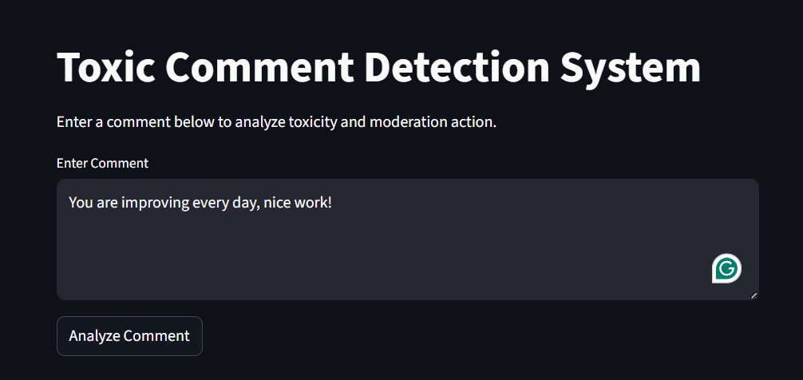
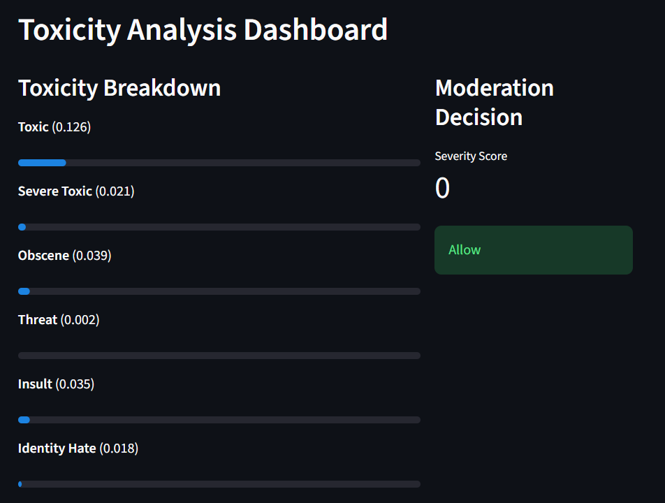
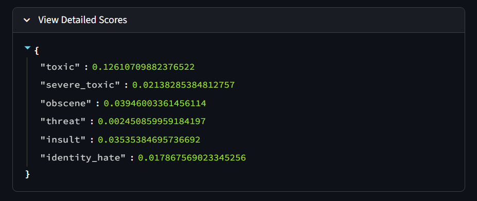

# Toxic Comment Detection & Moderation System

A machine learning-powered system that detects toxic comments and applies intelligent moderation actions based on severity levels.

---

## Features

* Multi-label toxicity classification (6 categories)
* Probability-based predictions using TF-IDF + Logistic Regression
* Class-specific threshold tuning for real-world moderation
* Severity scoring system
* Automated moderation actions (Allow / Warn / Auto-ban)
* Visual heatmap for toxicity interpretation
* Interactive Streamlit web app

---

## Toxicity Categories

* Toxic
* Severe Toxic
* Obscene
* Threat
* Insult
* Identity Hate

---

## Tech Stack

* Python
* Scikit-learn
* Pandas
* NumPy
* Streamlit
* Matplotlib / Seaborn

---

## Project Structure

```
toxic_comment/
│
├── data/                  # Dataset
├── models/                # Saved model & vectorizer
│   ├── toxicity_model.pkl
│   └── vectorizer.pkl
│
├── src/
│   ├── preprocess.py
│   ├── train_model.py
│   ├── evaluate.py
│   └── moderation_rules.py
│
├── notebooks/
│   └── toxic_classifier.ipynb
│
├── app.py                 # Streamlit app
├── requirements.txt
└── README.md
```

---

## Installation

```bash
git clone https://github.com/your-username/toxic-comment-system.git
cd toxic-comment-system
pip install -r requirements.txt
```

---

## How to Run

### 1. Preprocess Data

```bash
python src/preprocess.py
```

### 2. Train Model

```bash
python src/train_model.py
```

### 3. Evaluate Model

```bash
python src/evaluate.py
```

### 4. Run Web App

```bash
streamlit run app.py
```

---

## Example Output

| Comment         | Severity Score | Action   |
| --------------- | -------------- | -------- |
| You are amazing | 0              | Allow    |
| You are stupid  | 5              | Auto-ban |
| I will hurt you | 1              | Warn     |

---

## Model Approach

* Text preprocessing and cleaning
* TF-IDF vectorization
* Multi-label classification using Logistic Regression
* Probability extraction using `predict_proba()`
* Custom thresholding for each class
* Rule-based severity scoring

---

## Moderation Logic

| Severity Score | Action    |
| -------------- | --------- |
| 0              | Allow     |
| 1–2           | Warn User |
| ≥3            | Auto-ban  |

---

## Key Highlights

* Converts model probabilities into real-world moderation decisions
* Uses threshold tuning instead of raw predictions
* Combines ML + rule-based logic for better control
* Visualizes toxicity levels using heatmaps

---


## Demo

### 1. User Input Interface

Enter a comment and analyze toxicity.



---

### 2. Toxicity Analysis Dashboard

Visual breakdown of toxicity levels with moderation decision.



---

### 3. Detailed Probability Scores

Raw prediction probabilities for each toxicity label.



---

## Future Improvements

* Model calibration (Platt Scaling / Isotonic Regression)
* Deep learning (BERT / Transformers)
* Real-time API deployment
* User authentication system

---

## Author

**Pravin kd**

---

## If you like this project

Give it a star on GitHub ⭐
